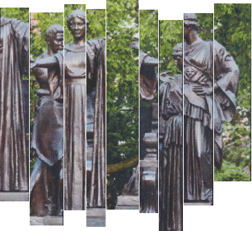

## ECE549 / CS543 Computer Vision, Spring 2024, Assignment 1

### Instructions

1.  Assignment is due at **11:59:59 PM on Friday Feb 02, 2024**.

2.  See [policies](http://saurabhg.web.illinois.edu/teaching/ece549/sp2024/policies.html)
    on [class website](http://saurabhg.web.illinois.edu/teaching/ece549/sp2024/).

3.  Submission instructions:

    1.  A single `.pdf` report that contains your work for Q1, Q2, and Q3.3. You can either type out your responses in LaTeX, or
        any other word processing software.  You can also hand write them on a
        tablet, or scan in hand-written answers. If you hand-write, please make
        sure they are neat and legible. If you are scanning, make sure that the
        scans are legible. Lastly, convert your work into a `PDF`. 

        PDF file should be submitted to
        [Gradescope](https://www.gradescope.com) under `MP1`. Course code is
        **GPXB23**. Please tag the reponses in your PDF with the Gradescope
         questions outline as described in [Submitting an Assignment](https://youtu.be/u-pK4GzpId0).  

    2.  For coding questions (Q3.1, Q3.2) we are using **gradescope autograder** for testing your code. For this to work, you will need to submit the code according to the following instructions:
        - Code should be submitted to [Gradescope](https://www.gradescope.com) under `MP1-code`, you will need to submit two *python* files for questions 3.1 and 3.2: `reorder.py`, and `align_reorder.py`.
        - Do not compress the files into `.zip` as this will not work.
        - Do not change the provided files names nor the names of the functions but
        rather change the code inside the provided functions and add new functions.
        Also, make sure that the inputs and outputs of the provided functions are
        not changed.
        - The autograder will give you feedback on how well your code did.
        - The autograder is configured with the following python libraries only:
            - numpy
            - imageio

    3.  We reserve the right to take off points for not following
        submission instructions. In particular, please tag the responses in your
        PDF with the Gradescope questions outline as described in
        [Submitting an Assignment](https://youtu.be/u-pK4GzpId0)).

4.  Lastly, be careful not to work of a public fork of this repo. Make a
    private clone to work on your assignment. You are responsible for
    preventing other students from copying your work. Please also see point 2
    above.


### Problems


1.  **Calculus Review [10 pts Manually Graded].**

    The  $`\operatorname{softmax}`$ function is a commonly-used operator which
    turns a vector into a valid probability distribution, i.e. non-negative
    and sums to 1.

    For vector  $`\mathbf{z}= (z_1, z_2, \ldots, z_k) \in \mathbb{R}^k`$, the
    output $`\mathbf{y} = \operatorname{softmax}({\mathbf{z}}) \in \mathbb{R}^k`$,
    and its $`i`$-th element is defined as 
    ```math
    y_i = \operatorname{softmax}({\mathbf{z}})_i = \frac{ \exp(z_i) }{ \sum_{j=1}^k \exp(z_j)}
    ```

    Answer the following questions about the $`\operatorname{softmax}`$ function.
    Show the calculation steps (as applicable) to get full credit.

    1.  **Shift Invariance [3 pts].** Verify that
        $`\operatorname{softmax}({\mathbf{z}})`$ is invariant to constant
        shifting on $`{\mathbf{z}}`$, i.e.
        $`\operatorname{softmax}({\mathbf{z}}) = \operatorname{softmax}({\mathbf{z}}- C\mathbf{1})`$
        where $`C \in \mathbb{R}`$ and  $`\mathbf{1}`$ is the all-one vector. The
         $`\operatorname{softmax}({\mathbf{z}}- \max_j z_j)`$
        [trick](https://timvieira.github.io/blog/post/2014/02/11/exp-normalize-trick/)
        is used in deep learning packages to avoid numerical overflow.

    2.  **Derivative [3 pts].** Let
        $`y_i = \operatorname{softmax}({\mathbf{z}})_i, 1\le i\le k`$.
        Compute the derivative  $`\frac{\partial y_i}{\partial z_j}`$ for any
        $`i,j`$ Your result should be as simple as possible, and may contain
        elements of $`{\mathbf{y}}`$ and/or $`{\mathbf{z}}`$ (Hint: You might need Kroneker delta function  $`\delta_{ij} = \mathbb{1}[i = j]`$) 

    3.  **Chain Rule [4 pts].** Consider $`{\mathbf{z}}`$ to be the output of a
        linear transformation $`{\mathbf{z}}= W^\top {\mathbf{x}} - {\mathbf{u}}`$ where
        vector $`{\mathbf{x}}\in \mathbb{R}^d`$ matrix
        $`W \in \mathbb{R}^{d \times k}`$ and vector $`{\mathbf{u}} \in \mathbb{R}^k`$ Denote
        $`\{ {\mathbf{w}}_1, {\mathbf{w}}_2, \ldots, {\mathbf{w}}_k \}`$ as
        the columns of $`W`$ Let
        $`{\mathbf{y}}= \operatorname{softmax}({\mathbf{z}})`$ Compute
        $`\frac{\partial y_i}{\partial {\mathbf{x}}}`$ 
        $`\frac{\partial y_i}{\partial {\mathbf{w}}_j}`$ and
        $`\frac{\partial y_i}{\partial {\mathbf{u}}}`$ (Hint: You may
        reuse (1.2) and apply the chain rule. Vector derivatives:
        $`\frac{\partial (\mathbf{a} \cdot \mathbf{b}) }{\partial \mathbf{a} } = \mathbf{b}`$
        $`\frac{\partial (\mathbf{a} \cdot \mathbf{b}) }{\partial \mathbf{b} } = \mathbf{a}$
        .)

2.  **Linear Algebra Review [10 pts Manually Graded].** Answer the following questions about
    matrices. Show the calculation steps (as applicable) to get full credit.

    1.  **Matrix Multiplication [2 pts].** Let $`V = 
            \begin{bmatrix}
            \frac1{\sqrt{2}} & -\frac1{\sqrt{2}}  \\
                \frac1{\sqrt 2}  & \frac1{\sqrt 2} 
            \end{bmatrix}`$ Compute
        $`V \begin{bmatrix} 1 \\ 0 \end{bmatrix}`$ and  
        $`V \begin{bmatrix} 0 \\ 1 \end{bmatrix}`$. What does matrix
        multiplication $`Vx`$ do to $`x`$?

    2.  **Matrix Transpose [2 pts].**  Verify that $`V^{-1} = V^\top`$ What does
        $`V^\top x`$ do to $`x`$?


    3.  **Diagonal Matrix [2 pts].**  Let $`\Sigma = 
            \begin{bmatrix}
                3 & 0 \\
                0 & 5
            \end{bmatrix}`$ Compute $`\Sigma V^\top x`$ where
        $`x = \begin{bmatrix} \frac1{\sqrt{2}} \\ 0 \end{bmatrix}, 
            \begin{bmatrix} 0 \\ \frac1{\sqrt{2}} \end{bmatrix}, 
            \begin{bmatrix} -\frac1{\sqrt{2}} \\ 0 \end{bmatrix}, 
            \begin{bmatrix} 0 \\ -\frac1{\sqrt{2}} \end{bmatrix}`$ respectively.
        These are 4 corners of a square. How is the square transformed by $`\Sigma V^\top`$ ?

    4.  **Geometric Interpretation [2 pts].**  Compute $`A = U\Sigma V^T = \begin{bmatrix} -\frac{\sqrt 3}2 & \frac12 \\ -\frac12 & -\frac{\sqrt 3}2 \end{bmatrix} \begin{bmatrix} 3 & 0 \\ 0 & 5 \end{bmatrix} \begin{bmatrix} \frac1{\sqrt{2}} & -\frac1{\sqrt{2}}  \\ \frac1{\sqrt 2}  & \frac1{\sqrt 2} \end{bmatrix}^\top`$ From the above
        questions, we can see a geometric interpretation of $`Ax`$: (1) $`V^\top`$
        first rotates point $`x`$ (2) $`\Sigma`$ rescales it along the
        coordinate axes, (3) then $`U`$ rotates it again. Now consider a
        general squared matrix $`B \in \mathbb{R}^{n\times n}`$ How would you obtain
        a similar geometric interpretation for $`Bx`$?

    5. **Homogeneous Equation [2 pts].** Suppose $`A = U\Sigma V^T = \begin {bmatrix} -\frac{1}{\sqrt 5} & \frac2{\sqrt 5} \\ -\frac2{\sqrt 5} & -\frac1{\sqrt 5} \end{bmatrix} \begin {bmatrix} 2 & 0 \\ 0 & 0 \end{bmatrix} \begin{bmatrix} \frac1{\sqrt{2}} & -\frac1{\sqrt{2}}  \\ \frac1{\sqrt 2}  & \frac1{\sqrt 2} \end{bmatrix}^\top`$ Find $`x`$ where $`Ax=0`$ and $`\left \lVert x \right \rVert = 1`$ (Hint: Columns of $`V`$are orthonormal)

3.  **Un-shredding Images [30 pts].**
    We accidentally shredded some images! In this problem, we will recover the
    original images from the corresponding shreds. Along the way we will learn how
    to deal with and process images in Python. Example input / output is shown
    below.
    
    <div align="center">
    
    
    </div>
    
    1.  **Reorder [10 pts Autograded].** We will start simple, and work with images where the
        shredder simply divided the image into vertical strips. These are prefixed
        with `simple_` in the [shredded-images](shredded-images) folder. Each folder
        contains the shreds (as individual files) for that particular image. 
        We provide the starter code in [reorder.py](reorder.py). You can run `python reorder.py`
        to see the demo output.
        
        As you noticed, without correctly ordering the
        strips, the images didn't quite look correct. Our goal now is to identify the
        correct ordering for these strips. We have implemented a simple greedy
        algorithm. Start with a
        strip and place the strip that is most compatible with it on the left and
        the right side, and so on. 
        
        To achieve this, for each pair of strips, we need to compute how well does strip 1 go immediately 
        left of strip 2 in function `pairwise_distance`. The function measures the similarity
        between the last column of pixels in strip 1 and the first column of pixels in
        strip 2 for all pairs of strips. You can measure similarity using (negative of) the *sum of squared
        differences* which is simply the L2 norm of the pixel difference. 
        
        Once you have computed the similarity between all pairs of strips in 
        `pairwise_distance`, the provided greedy algorithm will composite the image together. 
    
        **Implement the function `pairwise_distance` in [reorder.py](reorder.py). Submit the file to gradescope.**
        
    2.  **Align and Re-order [16 pts Autograded].** Next, we will tackle the case where our
        shredder also cut out the edges of some of the strips, so that they are no
        longer aligned vertically.
        These are prefixed with `hard_`. We will now
        modify the strip similarity function from the previous part to compensate for
        this vertical misalignment and colorization. 
    
        We will vertically slide one strip relative to the other, in the range of 20% 
        of the vertical dimension to find the best alignment, and compute
        similarity between the overlapping parts for different slide amounts. We
        will use the *maximum* similarity over these different slide amounts, as the
        similarity between the two strips. 
        
        You need to implement your own `solve` function in [align_reorder.py](align_reorder.py). The function takes list of images as input and returns the `order` (order of the images in the list) and `offsets` (the offset of the **ordered image** to the upper side of the canvas). You can visualize the composite image by passing in the returned `order` and `offsets` to the provided `composite` function. We provide the ground truth `order` and `offsets` to generate the almastatue teaser image in `align_reorder.py`. Please refer to `python align_reorder.py` for a deeper understanding of these return parameters.
    
        **Implement the function `solve` in [align_reorder.py](align_reorder.py). Submit the file to gradescope.**

    3. **Noisy Data [4 pts Manually Graded].** The provided `simple_` and `hard_` datasets are synthetically 
       cut from images. Real world data is often noisy, with missing boundary pixels and 
       discolorisations. We have provided you actual scans of image strips in 
       `scan_`. 

       <div align="center">
        
        </div>
    
        Using what you have implemented in part Q3.2, stitch these strips together. 
        Note that you may need to experiment with
        similarity functions other than the sum of squared distances. One common
        alternative is zero mean normalized cross correlation, which is simply the
        dot product between the two pixel vectors after they have been normalized to
        have zero mean and unit norm. You may also need to look at more than just 
        1 column of pixels to overcome noise (e.g. average the last three pixel columns
        for each strip).
        
        

        **Submit stitched result as part of PDF to gradescope. A completely successful stitch is not 
        required for full credit, stitches with minor errors are ok too. But make sure to describe what 
        you tried to get things to work. Note your observations, e.g. are there regions of the image
        that are easy / hard, and if so, why?**

      
