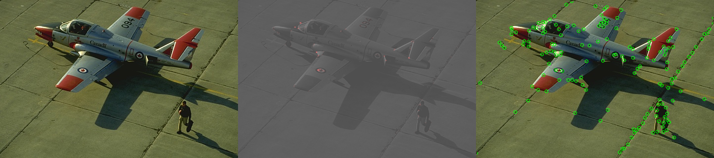
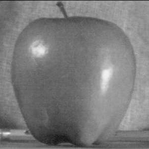
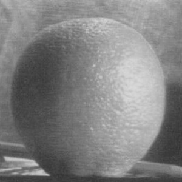
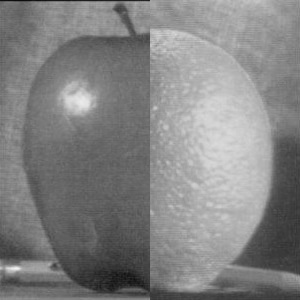

## ECE549 / CS543 Computer Vision: Assignment 3

### Instructions 

1.  Assignment is due at **11:59:59 PM on Friday, March 1, 2024**.

2.  See [policies](http://saurabhg.web.illinois.edu/teaching/ece549/sp2024/policies.html) on [class website](http://saurabhg.web.illinois.edu/teaching/ece549/sp2024/).

3.  Submission instructions:

    1.  A single `.pdf` report that contains your work for Q1, Q2 and Q3. We have provided template files for preparing your solutions to [Q1](contours/contour_solution_template.md), [Q2](corners/corner_solution_template.md) and [Q3](blend/blend_solution_template.md). You can use the `.md` files directly and convert them to a single `.pdf` before submission or use your favorite text editor while following the solution templates format.
    
    2. You should respond to the questions individually and include images as necessary. Your response in the PDF report should be self-contained. It should include all the output you want us to look at. You will not receive credit for any results you have obtained, but failed to include directly in the PDF report file. PDF file should be submitted to [Gradescope](https://www.gradescope.com) under `MP3`. Course code is **GPXB23**. Please tag the responses in your PDF with the Gradescope questions outline as described in [Submitting an Assignment](https://youtu.be/u-pK4GzpId0).  

    3.  In this assignment we are using **gradescope autograder** to test your code for Q1 and Q2. For this to work, you will need to submit the code according to the following instructions:
        - Code should be submitted to [Gradescope](https://www.gradescope.com) under `MP3-code`, you will need to submit three *python* files for the three assignment questions: `contour_solve.py`, `corner_solve.py`, and `blend_solve.py`. `blend_solve.py` won't be autograded but failure to include your solution code to Q3 will lead to zero credit on Q3.  
        - *Not submitting your code will lead to a loss of 100% of assignment points.*
        - *Note:* Do not compress the files into `.zip` as this will not work.
        - Do not change the provided files names nor the names of the functions but rather change the code inside the provided functions and add new functions. Also, make sure that the inputs and outputs of the provided functions are not changed.
        - The autograder is configured with the following python libraries only:
          - numpy
          - opencv-python
          - scipy
          - scikit-image
          - pillow
          - If you need to install other libraries (with proper justification) please let us know through campuswire.
        - You can also choose to post your results to the leaderboard, and challenge your classmates on results for questions Q1 and Q2!

4.  We reserve the right to take off points for not following submission instructions or templates.

5.  You only need to change `contour_solve.py`, `corner_solve.py`, and `blend_solve.py` files, please run `pip install -r requirements.txt` to install required packages. *Also, you are not allowed to use library functions that trivialize the problems. For example, you are not allowed to use functions to compute image pyramids, detect edges, detect corners, non-maximum suppression, hysteresis, etc*.

6.  Lastly, be careful not to work of a public fork of this repo. Make a private clone to work on your assignment. You are responsible for preventing other students from copying your work. Please also see point 2 above.

### Problems

1.  **Contour Detection [20 pts]**. In this problem we will build a basic contour detector. We will work with some images from the BSDS dataset [^1], and benchmark the performance of our contour detector against human annotations. You can review the basic concepts from the [contour detection lecture](http://saurabhg.web.illinois.edu/teaching/ece549/sp2024/slides/lec08_edges.pdf).

    We will generate a per-pixel boundary score. We will start from a bare bone edge detector that simply uses the gradient magnitude as the boundary score. We will add non-maximum suppression, image smoothing, and optionally additional bells and whistles. We have provided some starter code, images from the BSDS dataset and evaluation code.
    

    
    
    
    

    1. **[0 pts] Preliminaries.** We have implemented a contour detector that uses the magnitude of the local image gradient as the boundary score. This gives us overall max F-score, average max F-score and AP of 0.450, 0.516, 0.385 respectively on the `val` set. Reproduce these results by :
        1. Compiling the extension module for evalution by `python3 setup.py build_ext --inplace` under the `contours` folder. If you meet the error `'ios' file not found ` on Macos, please try `CFLAGS='-stdlib=libc++' python3 setup.py build_ext --inplace` instead. 
        2. (Skip if you were able to  install the extension module successfully) If you find it difficult to compile the extension module on your local computer or laptop, we also provide `contour_demo.ipynb` on Google colab which helps you to compile the module on cloud for this question. You can upload the whole `contours` folder to your google drive and starts the `contour_demo.ipynb` from there. 
        3. Then, run `python3 contour_demo.py` to confirm your setup by matching performance metrics listed above. When you run `contour_demo.py`, it saves the output contours in the folder `contours/output/demo`, prints out the 3 metrics, and produces a precision-recall (pr) plots at `contours/output/demo_pr.pdf`. Overall max F-score is the most important metric, but we will look at all three. 
        4. For the next parts you have to change the code inside `contour_solve.py` and set output directory for each implementation, for instance `python3 contour_demo.py --output_dir output/part1` will produce the results and PR plot in `output/part1` directory. 
        5. As you will notice, running the benchmark takes some time. We also provide `val_mini` set for faster evaluation and development of your code, but all numbers in the final report must be from evaluations on the `val` set.
    
    2.  **[1 pts] Warm-up.** As you visualize the produced edges, you will notice artifacts at image boundaries. Modify how the convolution is being done to minimize these artifacts.

    3.  **[2 pts] Smoothing.** Next, notice that we are using [−1, 0, 1] filters for computing the gradients, and they are susceptible to noise. Use derivative of Gaussian filters to obtain more robust estimates of the gradient. Experiment with different sigma for this Gaussian filtering and pick the one that works the best.
    
    4.  **[4 pts] Non-maximum Suppression.** The current code does not produce thin edges. Implement non-maximum suppression, where we look at the gradient magnitude at the two neighbours in the direction perpendicular to the edge. We suppress the output at the current pixel if the output at the current pixel is not more than at the neighbors. You will have to compute the orientation of the contour (using the X and Y gradients), and implement interpolation to lookup values at the neighbouring pixels.
    
    5.  **[Upto 3 pts] Extra Credit.** You should implement other modifications to get this contour detector to work even better. Here are some suggestions: compute edges at multiple different scales, use color information, propagate strength along a contiguous contour, etc. You are welcome to read and implement ideas from papers on this topic. Extra credit will be based on implementation efforts and score that you receive on the test set when you submit to gradescope (see below). 
    
    6.  **[13 pts] Gradescope autograding.** Submit code in `contour_solve.py` for your best model to gradescope. Include the numbers that you obtain from the auto-grader into your table. Our full implementation is able to achieve an overall max F-score of approx. 0.590 and an average precision score of approx. 0.590, your implementation must score higher than them for full credit. If you want, you can also show your scores on the class leaderboard, and challenge your classmates to beat you!
    
    **Deliverables.** Use the provided [solution template](contours/contour_solution_template.md). Your report should include the following. These will collectively contribute to your score for parts 2 through 5. Make sure to look at the template for details on what we want to see in the report. 
    - *Metrics / plots*. Compile the contour quality performance metrics and runtime for the different methods on the `val` set into a results table. Use [contours/contour_plot.py](./contours/contour_plot.py) to compile precision-recall plots into one plot. We provided a code that will collect all results from output directories and produce an overall pr plot, for instance `python3 contour_plot.py --dirs output/demo,output/part1 --names given-code,part1-code`
    - *Key implementation details* focusing on the non-trivial aspects, hyper-parameters that worked the best.
    - *Visual examples*, that show the effects of each of your modification with comments about your observations on up to three images. 

2.  **Corner Detection [20 pts]**. In this problem we will implement the Harris corner detector. You can review the basic concepts from the [lecture](http://saurabhg.web.illinois.edu/teaching/ece549/sp2024/slides/lec09_corner.pdf). Given an image as input, your have to implement the corner response function and non-maximum suppression. Instead of thresholding the corner response function in your code, you will return a scalar cornerness score value (between 0 and 255) at the location of the detected corners. This will allow us to benchmark the output, and can be thresholded later on to make qualitative visualizations. You will work with some synthetic images (from here[^2]) where we will do quantitative evaluation, and some real images where we will do qualitative evaluation.

    

    
    

    
    We have provided you starter code and the relevant images along with ground truth in the [corners](./corners) folder. The entry point into the code [corners/corner_demo.py](corners/corner_demo.py). Your implementation goes into [corners/corner_solve.py](corners/corner_solve.py).
    - For qualitative evaluation, you can run `python3 corner_demo.py --mode vis --output_dir output/demo --vis_thresh 25.5`. This will write out a visualization of the image, the corner responses function (overlaid onto the image), and corners detected above a threshold (25.5, feel free to tweak it) into a file that you can visualize.
    - For quantitative evaluation, you can run `python3 corner_demo.py --mode benchmark --output_dir output/demo`. This will write out the detected corners (as images) and corner detection metrics into the folder `output/demo/bench`. We are using average precision of corner detection as the metric (higher is better).

    The default implementation doesn't do anything (it places corners randomly in the image), and so doesn't get good scores. Implement the corner response function and non-maximum suppression, as described in class.

    1. **Basic Implementation and Results [5 pts]** Report the average precision and run-time of your corner detector (with and without non-maximum suppression). Also include the relevant precision recall plot. You can use the script [corners/corner_plot.py](./corners/corner_plot.py) to plot the different runs onto a single plot similar to question 1. Our full implementation is able to achieve an average precision score of approx. *0.453*, your implementation must score higher than this for full credit. Note that there are a number of hyper-parameters associated with the Harris corner detector (the $`\alpha`$, the $`\sigma`$ for the Gaussian weights, the size of the neighborhood for non-maximum suppression, etc.). You may want to try out different values for these hyper-parameters, to see what works best. Include results for the hyper-parameters that you tried in the table and plot as necessary. Also include any other key implementation detail focusing on the non-trivial aspects.
    2. **Visualizations [5 pts]** Include visualization on 3 images. Comment on your observations, where does your corner detector work well, where it doesn't and why? We provide some images in [corners/data/vis](corners/data/vis), but you are free to use your own images as well.
    3. **[Upto 3 pts Extra Credit] Bells and Whistles.** Improve the performance of your corner detector by incorporating any bells and whistles. You can investigate alternate response functions, alternate ways of computing image gradients, and any other ideas that you may have. Briefly describe what you did, and include experiments that show the effectiveness of your ideas. Extra credit will be based on implementation efforts and score that you receive on the test set when you submit to gradescope (see below). 
    4. **[10 pts] Gradescope autograding.** Submit your code in `corner_solve.py` for your best model to gradescope. Include the numbers that you obtain from the auto-grader into your table. If you want, you can also show your scores on the class leaderboard, and challenge your classmates to beat you! 

    **Deliverables.** Please use the provided [solution template](./corners/corner_solution_template.md). Your report should include the following. These will collectively contribute to your score fo parts 1 through 4. Make sure to look at the template for details on what we want to see in the report.
    - *Metrics / plots*. Use [corner_plot.py](corner_plot.py) to add curves for the different methods that you implemented into a single plot.
    - *Key implementation details* focusing on the non-trivial aspects, hyper-parameters that worked the best.
    - *Visual examples*, that show the effects of your implementation with comments about your observations on up to three images.

3.  **Multiresolution Blending [15 pts]** [^3]
    In this question, you will implement multi-resolution blending to produce the *oraple*! Simply concatenating slices of an orange and an apple doesn't quite work (as shown below), in this problem we will use multi-resolution blending to produce a better result. 

    

        
        
        
    

    
    Producing the oraple involves appropriately blending the different frequency bands. You can look at the original paper[^4] or the [slides](http://saurabhg.web.illinois.edu/teaching/ece549/sp2024/slides/lec07_filter_frequency.pdf) for more details. Please note 2 points:
      - While both the paper and the slides talk about using image *pyramids* for doing the blending, you can also do this just using image *stacks*. Instead of downsampling the images as in an image pyramid, in an image stack, images are never downsampled. To create the successive levels of the Gaussian Stack, just apply the Gaussian filter at each level, but do not subsample. The difference of successive levels will still capture frequency bands, as in an image pyramid.
      - As we are working with stacks and not pyramids, use the algorithm in page 230 of the paper instead of the one in page 226. The version in page 226 assumes the use of a pyramid and so uses a constant blending zone (which in original image will correspond to a seam size that is appropriate to the frequency band). When working with stacks, we will have to also keep track of the optimal blending zone. But this can be done simply by creating a Gaussian stack of the mask image. Progressive smoothing of the mask image will appropriately smooth out the transitions in the different frequency bands. For the vertical seam, your mask will simply be a step function of the same size as the original images (see [blend/mask.png](blend/mask.png)).

      1. **[10 pts Oraple].** Your task is the fill in code in [blend/blend_solve.py](blend/blend_solve.py) to do the multi-resolution blending. Blend the given orange and apple images. Include the blended image into your report, along with key implementation details and choice of hyper-parameters. To run the code use `python3 blend_demo.py --im1 apple.jpeg --im2 orange.jpeg --mask mask.png --out_name result.png`. Adjust the flags to provide the images to be blended and the mask. This will read the blend function you modified in `blend_solve.py` and generate `result.png` image.
      2. **[5 pts Blends of your choice].** Blend together two images of your own choice. Your implementation should be able to handle arbitrary seams (and not just vertical seams in the part above), so you can try some creative blends! 

    **Deliverables.** Please use the provided [solution template](blend/blend_solution_template.md). Your report should include the following:
    - *Method description*. Description of what you tried for blending the Oraple and images of your choice.
    - *Results* of the blends for the above two parts.

#### References

[^1]: D. Martin, C. Fowlkes, D. Tal, and J. Malik. A database of human segmented natural images and its application to evaluating segmentation algorithms and measuring ecological statistics. In ICCV, volume 2, pages 416–423, July 2001.

[^2]: https://github.com/rpautrat/SuperPoint

[^3]: Adapted from https://inst.eecs.berkeley.edu/~cs194-26/fa20/hw/proj2/

[^4]: P Burt and E. Adelson. [A Multiresolution Spline With Application to Image Mosaics](http://persci.mit.edu/pub_pdfs/spline83.pdf). ACM Transactions on Graphics, 1983. 
