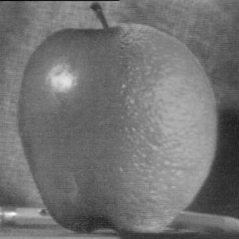

## Multi-resolution Blending - Solution

### Method Description

To blend two images, the steps I follow can be summarized as follow:

1. Calculate the pyramaid of Laplacian of two input image using different scale of $sigma$.
    * To get the pyramaid, I use gaussian filter to filter different group of frequency. As what we use is acturally the stack of image, for every layer, I only change the value of the $sigma$ to get a blurred image and the laplacian image is $blurred\_image - original\_image$.
    * For the last layer, also store the blurred image.
2. Calculating the Gaussian pyramaid of mask.
    * The method to get the gaussian pyramaid is similiar to Lapalacian pyramaid. In this step, I only store the blurred image.
3. Get the laplacian pyramaids of the blended image with the two image with two laplacian pyramaids and mask gaussian pyramaid. The formula is $Blended[l] = Laplacian\_A[l] * Mask[l] + (1 - Mask[l]) * Laplacian\_B[l]$.
4. Collapse the pyraimaid to get the original image.
    * Since the last layer of the laplacian is the blurred image, directly add all of the layers together can restore the image.
### Oraple
The result of Oraple is shown as below.
| Original image |   |
| :-----: | :------:|
| **Blended image** |  | 

### Blends of your choice.

To blend the image I choose, I first need to preprocess the chosen image and generate the mask for them. To generate the mask, I 
1. Get the position that will be blended by observing and measuring the positions of region of interest.
2. Resize the two image to same size.
3. Generate the mask by only setting the pixel in the region of interest to be 1 and others be 0.

The blended image is shown as below

| Original image |  |
| :-----: | :------: |
| **Blended image** |  |

| Original image |  |
| :-----: | :------: |
| **Blended image** | |
