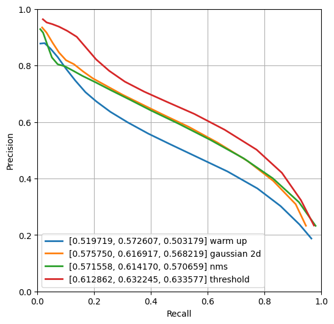
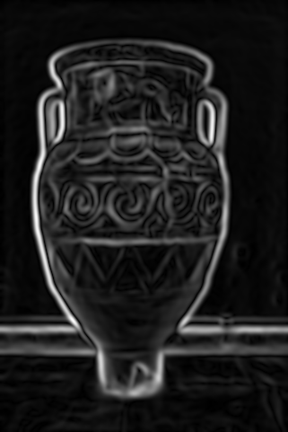
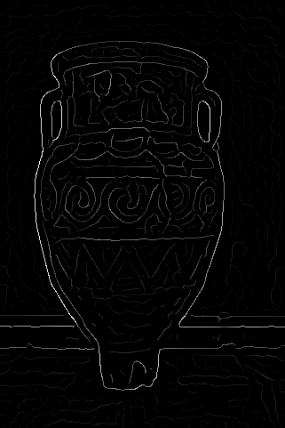

## Contour Detection - Solution Template

**NOTE:** All values and figures in this template are examples that you will need to replace with your own results

1. **Method Description.** *TODO*: Describe the different methods and their key implementation detials.

2. **Precision Recall Plot.** *TODO*: Use [contour_plot.py](contours/../contour_plot.py) to add curves for the different methods that you implemented into a single plot.
   
   

      
   

3. **Results Table.** *TODO*: Present the performance metrics for each implementation part on the val set in a table format

   | Method | overall max F-score | average max F-score | AP | Runtime (seconds) |
   | ----------- | --- | --- | ---  | --- |
   | Initial implementation | 0.450 | 0.516 | 0.385 | 0.010 |
   | Warm-up [remove boundary artifacts] | | | | |
   | Smoothing | | | | |
   | Non-maximum Suppression | | | | 
   | Val set numbers of best model [From gradescope] | | | |

4. **Visualizations.** *TODO:* Include visualization on 3 images from val set showing the impact of your implementation for each part. Describe the effect of your implementation for each part on these images by pointing to relevant image regions. Comment on where does your code work well, where it doesn't and why? You may also add visualizations of your own images. Here is how you can lay out images in markdown.
   

      
      
      
   

5. **Bells and Whistles.** *TODO*: Include details of the bells and whistles that you
   tried here.

   *TODO*: Present the performance metrics for the bells and whistles in a table format
   
   | Method | overall max F-score | average max F-score | AP | Runtime (seconds) |
   | ----------- | --- | --- | ---  | --- |
   | Best base Implementation (from above) | | | | 
   | Bells and whistle (1) [extra credit]) | | | | 
   | Bells and whistle (2) [extra credit]) | | | |
   | Bells and whistle (n) [extra credit]) | | | |
