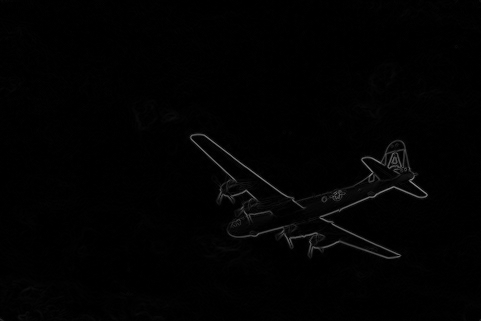
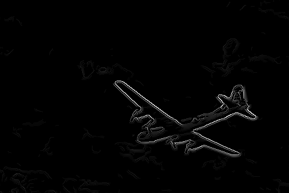
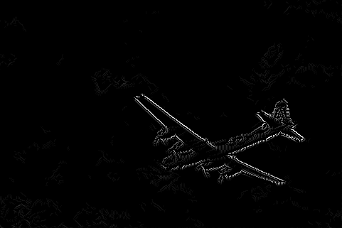

## Contour Detection 

#### Chang Liu(changl25)

1. **Method Description.** 

   I use Canny edge detector to detect the contour in image. The Canny detector mainly depends on the gradient change across the edge. For step edges or ramp edges, the gradient magnitude significantly differs from zero while areas lacking distinct edges exhibit a gradient magnitude close to zero. Thus, contour detection involves analyzing the gradient magnitude across the image. The Canny edge detector encompasses the following steps:
   * Using Gaussian to  mitigates the adverse effects of noise.
   * computing the initial edge map by determining the magnitude and orientation of gradient.
   * Applying non-maximum suppression to eliminate weak edges by only retaining local maxima in the gradient direction.
   * Thresholding to eliminate weak edges.

2. **Precision Recall Plot.** 

   The plot of precision and score of every step is shown as 

      

3. **Results Table.**

   | Method | overall max F-score | average max F-score | AP | Runtime (seconds) |
   | ----------- | --- | --- | ---  | --- |
   | Initial implementation | 0.450 | 0.516 | 0.385 | 0.010 |
   | Warm-up [remove boundary artifacts] | 0.519719  |0.572607  | 0.503179   | 0.012979  |
   | Smoothing | 0.575750 |0.616917 | 0.568219| 0.012630 |
   | Non-maximum Suppression | 0.571558  |0.614170 |0.570659  |0.143551 
   | Val set numbers of best model [From gradescope] |0.577  |0.616   |0.583  |0.35
   
   (The best result from gradescope seems different from the one running locally. That is the reason why the score on gradescope is different from the result on the plot)

4. **Visualizations.** 

   The following four images are the visualized images, which visualize the transformation at each significant step. They are the original image, warm-up image, the edge detected with Gaussian and Differential Filters, the edge that is been processed by non-maximum suppression and threshold. 

   

      
      
      
      
   

From these images, we can find that 
* Deal with the edge: The method used to handle image edges significantly influences the outcome of edge detection. When we set the mode to be **symmtric**, the pixel near the edge will be copied to solve the problem of the artifects.
* Effects of Combining Gaussian and Differential Filters: The sequential application of a Gaussian filter, followed by a differential filter, smooths the image, and reduces noise, resulting in a cleaner background. But the edge also become much wider than before.
* Influence of non-maximum suppression(nms): with nms, weaker, redundant edge pixels are effectively eliminated, thus the edges becomer sharper and most of them are single-pixel.
* Limitations: not all of the artifects are eradicated. Some incomplete or discontinuous edges and occasional double edges persist.

5. **Bells and Whistles.** 

   To improve the performance of the detectors, I have tried several methods. Some of them make the score to be higher, while some of them seems to produce better image visually, but the F-score and AP drops. 

   The methods I try include
   * Using different differential filter: beside the simple gradient by rows and colomns, I apply sobel as the differential filter and try to use different size of the sobel. After experiment, I found that the sobel with the size 5 works better for the given dataset.
   * Using multiple scale of image and combining the detected edges together: 
   * I also try to connect the broken edges with the neighbour of 8-connections. By using two threshold, the pixel that is between the high threshold and low threshold is conneced or filterd depending on its neighbours. Comparing its value with the 8-connections neighbours and they will be set to high value if they near a high threshold pixel. The result actually looks better but the point doesn't increase.
   

      
   

   
   | Method | overall max F-score | average max F-score | AP | Runtime (seconds) |
   | ----------- | --- | --- | ---  | --- |
   | Best base Implementation |0.570  |0.608   |0.568  |0.25
   | larger sobel(best)) |0.577  |0.616   |0.583  |0.35
   | Double threshold |0.577  |0.616   |0.583  |0.35
   | resize and multi-scale |0.586 | 0.617 |0.570 |0.26
   