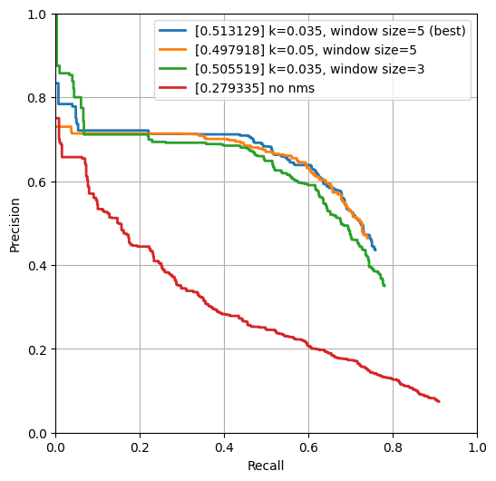
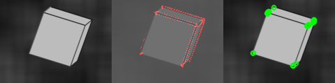

## Corner Detection - Solution Template

1. **Method Description.** 

I use Harris corner detector to find the corners in the image. The Harris corner detector is based on the difference of the gradient's magnitute of flat region, line and corner. The change of magnitude can be summarized as the eigenvalue of second moment matrix M. As a result, the detecor is to calculate the function of M.

It can be summarized as five steps:

* Calculate the image gradients along both the x and y axes
* Formation of the Second Moment Matrix M. M can be constructed from $I_x$ and $I_y$, which are gradient of image from x and y axes. 
* A Gaussian filter is applied to the gradients to diminish noise interference.
* Calculate the response function R. R assesses the interplay between the value of two eigenvalue of the matrix M. Areas where both eigenvalues are substantially positive is recognised as a corner. The value of eigenvalue can be represented from the M, which is
   * trace of M = $\lambda_1 + \lambda_2$
   * determinent of M = $\lambda_1 * \lambda_2$

   Here I use the response function $R = det(M) - k * trace(M)^2$, which can also be written as $I_x^2 * I_y^2 - I_x * I_y - k * (I_x + I_y)^2$
* Thresholding and Non-Maximum Suppression: Only the value that is larger than the threshold $\theta$ will be regarded as a corner. Also, apply non-maxium suppresion(NMS).

1. **Precision Recall Plot.** 

   

      
   

2. **Results Table.** 

   | Method                | Average Precision | Runtime |
   | --------------------- | ----------------- | ------- |
   | Random                | 0.002 | 0.001   |
   | Harris w/o NMS               |0.279 |0.063 |
   | nms win size = 5, k = 0.035, T = 0.01, gaus/ win = 5, sigma = 0.55  |0.513 |0.104 |
   | nms win size = 3, k = 0.035, T = 0.01, gaus/ win = 5, sigma = 0.55  |0.506 |0.108 |
   nms win size = 5, k = 0.05, T = 0.01, gaus/ win = 5, sigma = 0.55        |0.498 |0.103 |

4. **Visualizations.** 
The three visialized image is as following:
   

      
   

   

      
   

   

      
   

   Three images are generated with different threshold. The effect of each of them shows some of the strengths and limitations of Harris corner detector.
   * For the `cube_17`, it is generated with threshold 30. When the threshold is set high
      * Basically its edge will not be recoginzed as a combination of points and most of its points is detected, shows that Harris corner detector is good at distinguishing the horizontal and vertical edges from corner. 
      * It also doesn't misleaded by rotate.
      * But some of the corners are piled together, which means that the nms is not good enough to eliminate all of these repeat corners.
   * For the `ece` and `beckman`, they are generated with threshold 10. When the threshold is lower
      * For the complex image, almost all of its points can be detected.
      * But the points in the foreground and background, which is actually only fine details of background, will also be detected, which means that it will be affected by details.

5. **Bells and Whistles.** 

   I have tried some other methods to try to improve the performance of the corner detector, but it seems that they don't have very obvious and positive effect. The result for that may be the tuning of parameters is not enough.

   The methods I tried include

   * Differential filter: I also apply Sobel filter but the performance doesn't improve
   * More steps in threshold and NMS: Before using NMS, I preprocess the response function by set them all beyound zero
   * Response function: I also try the response function $R = \frac{det(M)}{trace(M)^2}$ but the result of it seems not quite good. It is seriously interpreted by the noise and the background pattern althoug I apply gaussian filter on it.

   | Method | Average Precision | Runtime |
   | ------ | ----------------- | ------- |
   | Best base Implementation (from above) | 0.513| 0.104|
   | Other response function | 0.01| 0.002|
   | extra step in NMS | 0.514| 0.103|
   | Other differential filter | 0.43| 0.1|
