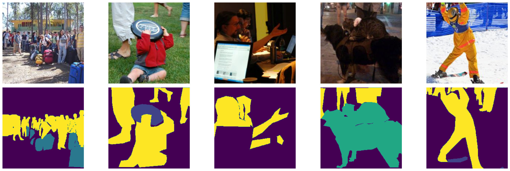
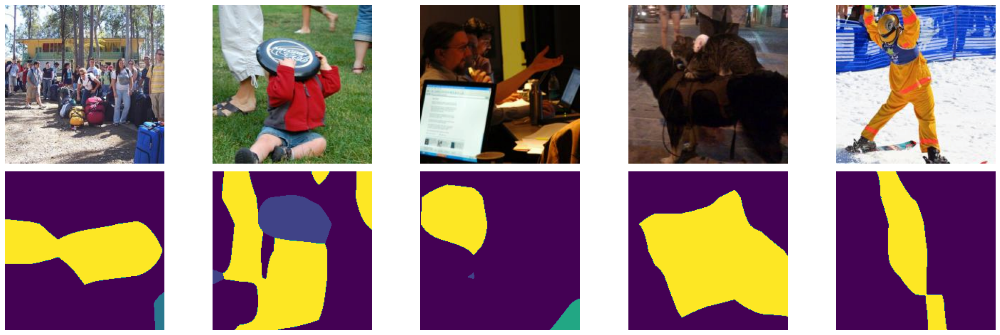
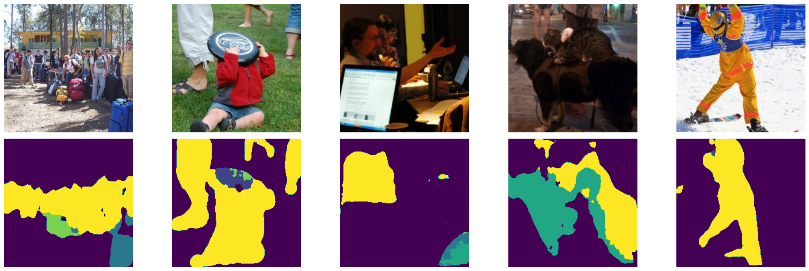

## ECE549 / CS543 Computer Vision: Assignment 5

### Instructions 

1.  Assignment is due at **11:59:59 PM on Friday April 26 2024**.

2.  See [policies](http://saurabhg.web.illinois.edu/teaching/ece549/sp2024/policies.html)
    on [class website](http://saurabhg.web.illinois.edu/teaching/ece549/sp2024/).

3.  Submission instructions:
    1. A single `.pdf` report that contains your work for Q1, Q2. For each individual question,
       we provide instruction for what should be included in your report. This should be submitted
       under `MP5` on gradescope. 
    2. For this assignment, we will use *gradescope autograder* for code submission and evaluation of your results on held-out test sets.
       For this to work, you will need to submit the code and results according to the following instructions:
       - Code and output files should be submitted to [Gradescope](https://www.gradescope.com) under `MP5-code` with the following structure:
         ```
         # Q1 code
         CS543_MP5_part1_starter_code.py
         # Q1 results
         Q1_label_predictions.npy (we provide code to generate these using your models, see below)
         # Q2 code
         CS543_MP5_part2_starter_code.py
         # Q2 results 
         Q2_sseg_predictions.npy (we provide code to generate these using your models, see below)
         ```
       - Do not compress the files into `.zip` as this will not work.
       - Do not submit any `.ipynb` file from Colab, you can convert it to python files by `File → Download → Download .py`.
       - File and folder names are case sensitive.
       - *Not following this instruction to submit your code and results will lead to a loss of 100% of assignment points.*
       - While we are not placing any limits on the number of times you can run your output through the auto-grader, we expect that
         you will limit yourself to a maximum of 2 valid submissions per day. You should primarily use the validation sets 
         for seeing how well you are doing and for picking hyper-parameters, and ideally we expect you to only submit the output
         of your final models to the test set. Hyper-parameters should not be tweaked on the test set. We can see the submission history and if we find too many submission to the test server in too short a time, we will penalize for it.

4.  Late submissions will not be eligible for extra-credits.

5.  Lastly, be careful not to work of a public fork of this repo. Make a
    private clone to work on your assignment. You are responsible for
    preventing other students from copying your work. Please also see point 2
    above.

### Google Colab and Dataset setup
In this assignment you will use [PyTorch](https://pytorch.org/), which is currently one of the most popular
deep learning frameworks and is very easy to pick up. It has a lot of tutorials and an active community answering
questions on its discussion forums. You will be using [Google Colab](https://colab.research.google.com/), a free environment
to run your experiments. Here are instructions on how to get started:

1. Login with your Illinois Google account. Note: you will not have access to starter codes using account outside
the illinois.edu domain.

1. Open [Q1 Starter code](https://colab.research.google.com/drive/1Z3uXN1BZnPjlcKPPjZuQ_XNWzwjknGgf) and 
[Q2 Starter code](https://colab.research.google.com/drive/1IGTetc2qVraL_lv4AiJ8xYYGG-cLVMPa),
click on File in the top left corner and select `Save a copy in Drive`.
This should create a new notebook, and then click on `Runtime → Change Runtime Type → Select GPU as
your hardware accelerator`. Make sure you copy both Q1 and Q2 to your Drive.

1. Follow the instructions in the notebook to finish the setup.

2. Keep in mind that you need to keep your browser window open while running Colab. Colab does not allow
long-running jobs but it should be sufficient for the requirements of this assignment.

### Problems

1. **Implement and improve BaseNet on CIFAR-10 [30 pts].** For this part of the assignment, you will be working with
    the [CIFAR-10](https://www.cs.toronto.edu/~kriz/cifar.html) dataset. This dataset consists of 60K 32 × 32 color images from
    10 classes. There are 50K training images and 10K validation images. The images in CIFAR-10 are of size
    3 × 32 × 32, i.e. three-channel RGB images of 32 × 32 pixels.

    Please note that for the entirety of question 1 (including extra credits), you are not allowed to use any pretrained models / additional datasets other than the ones that we have provided you.

    <div align="center">  </div>

    1. **Implement BaseNet [5 pts].** Implement the BaseNet with the neural network shown below.
       The starter code for this is in the BaseNet class. After implementing
       the BaseNet class, you can run the code with default settings to get a
       baseline accuracy of around 60% on the validation set. The BaseNet is
       built with following components:
       * Convolutional, i.e. `nn.Conv2d`
       * Pooling, e.g. `nn.MaxPool2d`
       * Fully-connected (linear), i.e. `nn.Linear`
       * Non-linear activations, e.g. `nn.ReLU`
       BaseNet consists of two convolutional modules (conv-relu-maxpool) and
       two linear layers. The precise architecture is defined below:

       | Layer No. | Layer Type  | Kernel Size | Input Dim | Output Dim  | Input Channels | Output Channels |
       | --------- | ----------- | ----------- | --------- | ----------- | -------------- | --------------- |
       | 1         | conv2d      | 5           | 32        | 28          | 3              | 6               |
       | 2         | relu        | -           | 28        | 28          | 6              | 6               |
       | 3         | maxpool2d   | 2           | 28        | 14          | 6              | 6               |
       | 4         | conv2d      | 5           | 14        | 10          | 6              | 16              |
       | 5         | relu        | -           | 10        | 10          | 16             | 16              |
       | 6         | maxpool2d   | 2           | 10        | 5           | 16             | 16              |
       | 7         | linear      | -           | 1         | 1           | 400            | 200             |
       | 8         | relu        | -           | 1         | 1           | 200            | 200             |
       | 9         | linear      | -           | 1         | 1           | 200            | 10              |

       **In your report, include:** your model by using Python print command
       `print(net)` and final accuracy on the validation set.

    2. **Improve BaseNet [20 pts].** 
       Your goal is to edit the BaseNet class or make new classes for devising
       a more accurate deep net architecture.  In your report, you will need to
       include a table similar to the one above to illustrate your final
       network.
       
       Before you design your own architecture, you should start by getting
       familiar with the BaseNet architecture already provided, the meaning of
       hyper-parameters and the function of each layer. This
       [tutorial](https://pytorch.org/tutorials/beginner/blitz/neural_networks_tutorial.html)
       by PyTorch is helpful for gearing up on using deep nets. Also, see
       Andrej Karpathy's lectures on
       [CNNs](http://cs231n.github.io/convolutional-networks/) and [neural
       network training](http://cs231n.github.io/neural-networks-3/).

       For improving the network, you should consider the following aspects.
       In addition, you can also try out your own ideas. Since Colab makes only
       limited computational resources available, we encourage you to
       rationally limit training time and model size. *Do not simply just copy
       over model architectures from the Internet.*

       * **Data normalization.** Normalizing input data makes training easier
       and more robust. You can normalize the data to made it zero mean and fixed standard
       deviation ($`\sigma = 1`$ is the go-to choice).  You may use
       `transforms.Normalize()` with the right parameters for this data
       normalization. After your edits, make sure that `test_transform` has the
       same data normalization parameters as `train_transform`.
       * **Data augmentation.** Augment the training data using random crops,
       horizontal flips, etc. You may find functions `transforms.RandomCrop()`,
       `transforms.RandomHorizontalFlip()` useful. Remember, you shouldn't
       augment data at test time. You may find the [PyTorch
       tutorial](https://pytorch.org/tutorials/beginner/data_loading_tutorial.html#transforms)
       on transforms useful.
       * **Deeper network.** Experiment by adding more convolutional and fully
       connected layers. Add more convolutional layers with increasing output
       channels and also add more linear (fully convolutional) layers.
       * **Normalization layers.** [Normalization
       layers](https://pytorch.org/docs/master/nn.html#normalization-functions)
       may help reduce overfitting and improve training of the model. Add
       normalization layers after conv layers (`nn.BatchNorm2d`). Add
       normalization layers after linear layers and experiment with inserting
       them before or after ReLU layers (`nn.BatchNorm1d`).

       **In your report, include:** 
       - Your best model. Include final accuracy on validation set, table
         defining your final architecture (similar to the BaseNet table above),
         training loss plot and test accuracy plot for final model
         (auto-generated by the notebook). A reasonable submission with more
         than 85% accuracy will be given full credit for this part.
       - An ablation table, listing all factors that you tried to make
         improvement to your final model as well as the corresponding validation 
         accuracy.

    3. **Secret test set [5 pts].** We also have a secret test set containing
       2000 images similar to CIFAR-10, under
       [Q1_test_data](https://drive.google.com/file/d/1ZbiifeCthzaisx9op0tFTlx2dbQsjuwU/view?usp=sharing).  Please copy the
       `cifar10_secret_test_data.npy` to `CS_543_MP4/data/cifar10-test` on your
       Google Drive. We have also included the code in the google colab to automatically download this for you!
        We provide code that saves your model predictions to a
       `Q1_label_predictions.npy` file. Submit the prediction for your best model to
       gradescope. If you want, you can also show your scores on the class
       leaderboard, and challenge your classmates to beat you!  
       
       **We will give upto 5pts of extra credits to top 5 performing entries on 
       the leaderboard!  Note that late submissions will not be eligible for extra-credits.**

       **In your report, include:** Test set accuracy (category-wise and aggregate) 
       for your best model. You can get this from gradescope. A reasonable submission 
       with more than 67% accuracy will be given full credit for this part.


2. **Semantic Segmentation [40 pts].** In this part, you will build your own sementic segmentation on a subset of the [COCO-Stuff ](https://github.com/nightrome/cocostuff). This task comprises of classifying image pixels into the following 6 categories: background, sports, accessory, animal, vehicle, person. We will use the mean average precision (on the soft output) and mean intersection over union (of the hard output) to measure performance. We provide code for computing these metrics. Please note that for the entirety of question 2 (including extra credits), you are not allowed to use any other pretrained models besides resnet18 pre-trained on the ImageNet dataset. you are also not allowed to use any additional datasets other than the ones that we have provided you.

    <div align="center">
    
    </div>

    **Data.** We have 700 images for training, 100 images for validation, 100 images for testing. Each image is RGB with size 224 x 224. 

   #### Starter Code
   We provide dataset visualization, a dataloader, a basic model (that trains a linear classifier on top of the pixel value at each location) and a simple training cycle.

    **What you need to do:** 
    
    1. **Implement training cycle:** You will need to modify the provided simple training cycle. Make sure you evaluate metrics and loss on the validation set every so often to check for overfitting.

    2. **Build on top of ImageNet pre-trained Model [5 pts]:** Your task is 
         to build on top of a ResNet 18 ([1](#references)) model that has been 
         pre-trained on the ImageNet dataset ([2](#references)) (via
         `models.resnet18(pretrained=True)`). These models are trained to predict the
         1000 ImageNet object classes. To use this model for semantic segmentation, you
         will have to remove the classifier and global average pooling layers, and stack
         on additional layers for semantic segmentation. Note that, ResNet-18 model downsamples the input image by a factor of 32, remeber to upsample your prediction using bilinear
         interpolation. Carefully document the design choices you
         make in your report. Please indicate which hyper parameters you tried, along with
         their performance on the validation set. For reference, our very basic first implementation could achieve a mAP of **0.73** and a mIoU of
         **0.49** under 20 minutes of training of 20 epochs. At the very least your implementation
         should achieve as much accuracy on the validation set, but you may be able to
         do better with more training and hyper-parameters tuning.

         Here are some sample prediction outputs using ResNet-18 model.
       
       <div align="center">  </div>


         In your report, include: model architecture, how you implement upsampling, training details and final performance on validation set.


    3. **Improve model performance [5 pts]:** The current model
       simply replaces the final fully connected layer in a ResNet-18 model for
       semantic segmentation. This still has a lot of draw backs. The
       most important factors that causes poor performance is the low output
       resolution. ResNet-18 model for image classification downsamples the input
       image by a factor of 32. In the previous step, we recover the resolution by
       a simple bilinear interpolation layer which upsamples the prediction by 32
       times. In this part, our goal is to explore other choices to generate
       high-resolution predictions and improve segmentation performance:
       * **Atrous (or dilated) convolution.** The concept of atrous convolution 
         (or dilated convolution) is described it the DeepLab paper([3](#references)).
         One way to think about atrous convolution is to think of running the 
         network on shifted versions of the image and weaving the outputs together
         to produce an output at the original spatial resolution. This can be done
         simply by using the `dilataion` arguments in PyTorch. Refer to the paper([3](#references)) and PyTorch documentation for more detail. 

       * **Building a learned upsampler.**  Instead of using bilinear upsampling,
         you can use a decoder that *learns* to upsample 
         prediction to improve the output quality. The key that
         makes decoder works better than bilinear interpolation is the usage of
         *skip-connection*.  Refer to the U-net([4](#references)) and DeepLabv3+([5](#references)) for
         more detail.

        You can implement either of these two choices, or other choices you
        find in other papers to improve the segmentation performance. Please describe the methods you try in your report and report their
        performance.  For reference, our implementation with using a pretrained Resnet18 with U-net skip-connection decoders achieves mAP of **0.77** and mIoU of **0.56**. Your best model should achieve
        similar or higher performance. 

        Below is the performance of using U-net skip-connection decoders in ResNet-18:

         <div align="center">  </div>


       **In your report, include:**
         - Your best model an design choice. Include final performance on validation set.
         - An ablation table, listing all factors that you tried to make
         improvement to your final model as well as the validation performance.
         - visualization of model prediction on five of your favorite images from validation set. 


   1. **Secret test set [30 pts].** 
       The starter code produces predictions on the test set, writing to the file `Q2_sseg_predictions.npy`.  Upload the file `Q2_sseg_predictions.npy` for your best model on gradescope to have it graded. If you want, you can also show your scores on the class leaderboard, and challenge your classmates to beat you!  
       
       **We will give up to 4pts of extra credits to top-5 entries on the leaderboard!  Note that late submissions will not be eligible for extra-credits.**

       **In your report, include:** test set accuracy of your best model. 
       You can get this from gradescope. A reasonable submission with average IoU more
      than 0.53 will be given full credit for this part.


#### References
1. Kaiming He et al. Deep residual
learning for image recognition. In CVPR 2016.
2. Jia Deng el al. A
large-scale hierarchical image database. In CVPR 2009.
3.  Liang-Chieh Chen et al. "Semantic image segmentation with deep convolutional nets and fully connected CRFs." ICLR 2015.
4.  Olaf Ronneberger et al. "U-net: Convolutional networks for biomedical image segmentation." MICCAI 2015.
5. Liang-Chieh Chen et al. "Encoder-decoder with atrous separable convolution for semantic image segmentation." ECCV 2018.
